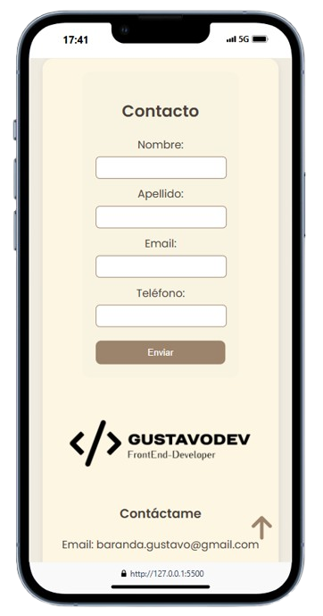
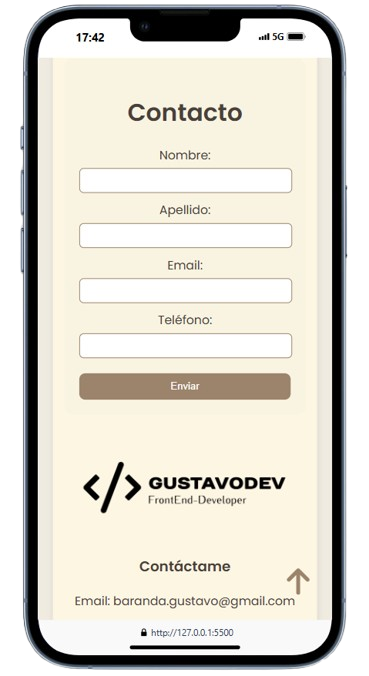

# 📌 Descripción del Proyecto

Este proyecto es un **portafolio personal** desarrollado como parte del curso de Front End en el IFTS 29. La página presenta mi experiencia, habilidades y proyectos destacados como desarrollador FrontEnd. Incluye:

✅ Sobre mí  
✅ Mis proyectos  
✅ Habilidades  
✅ Películas favoritas  
✅ Formulario de contacto  

### 🛠️ Tecnologías utilizadas
- **HTML, CSS y JavaScript**
- Librerías externas: *FontAwesome, Google Fonts y SweetAlert2*

🔗 **GitHub Pages:** [Ver Proyecto](https://gustavobaranda.github.io/PFO-1-IFTS-N-29/)

---

## ✅ Checklist - Práctica Formativa Obligatoria 1

### 📂 **Estructura del Proyecto**
- [✔️] Archivo `index.html` en la raíz.
- [✔️] Carpeta `css` con `styles.css`.
- [✔️] (Opcional) Carpeta `assets` para recursos gráficos.
- [✔️] Archivo `README.md` con descripción del TP y este checklist.

### 📌 **Repositorio y Publicación**
- [✔️] Repositorio en **GitHub** creado.
- [✔️] Proyecto subido al repositorio.
- [✔️] Proyecto publicado con **GitHub Pages**.
- [✔️] En el `README.md` se indica la URL de GitHub Pages.

### 🎨 **Uso de Google Fonts**
- [✔️] Enlace a Google Fonts incluido en la sección `<head>` del HTML.
- [✔️] Tipografía aplicada correctamente.
- [✔️] Redacta brevemente tu decisión: ¿Por qué elegiste esa fuente?
- **Fuente elegida:** *Poppins* ✨  
  _Motivo:_ Fuente moderna, elegante y legible. Su estilo geométrico aporta un diseño **profesional** y **minimalista**, alineado con las mejores prácticas de UI/UX.

### 🏗️ **HTML**
- [✔️] Inicia con `DOCTYPE` y usa `lang="es"`.
- [✔️] Se han incluido las metaetiquetas obligatorias: `charset`, `viewport`.
- [✔️] Se ha defi nido un título descriptivo
- [✔️] Se han vinculado correctamente el archivo CSS y el enlace a Google Fonts.

#### 🔹 **Secciones obligatorias en `<main>`:**
- [✔️] **Barra de navegación** (`nav`) con al menos 3 enlaces.
- [✔️] Se han insertado al menos 4 comentarios explicativos en el código HTML.

### 🎨 **CSS**
- [✔️] Archivo `styles.css` con estilos personalizados.
- [✔️] Se utilizan selectores basados en clases e identifi cadores.
- [✔️] La tipografía importada desde **Google Fonts** se aplica correctamente en todos los elementos. 

#### 📐 **Layout y Organización:**
- [✔️] Se ha organizado el layout (especialmente en la sección "tarjetas") utilizando **Flexbox o Grid**.
- [✔️] Redacta: ¿Qué ventajas encontraste al utilizar Flexbox o Grid en tu proyecto?
- **Motivo:** Flexbox facilita la **alineación flexible y responsiva**, permitiendo centrar contenido y adaptar el diseño sin necesidad de código complejo.

#### 🎭 **Estilización de Componentes:**
- [✔️] Se han personalizado los estilos de **tablas, botones, enlaces y formularios**.
- [✔️] Se han ajustado las dimensiones de imágenes y contenedores utilizando unidades relativas (`%`, `rem`, `vh`).
- [✔️] Se ha implementado al menos una animación o transición (por ejemplo, efecto hover en tarjetas o botones).
- [✔️] Redacta: ¿Qué animación o transición implementaste y por qué consideraste que era adecuada para tu proyecto?
> ✨ *Animaciones utilizadas:* `hover`, `transform`, `translate`, `transition`, `scale`, `rotate`.  
> **Motivo:** Mejora la interactividad. Por ejemplo, **scale en botones** de proyectos resalta cada una al pasar el cursor, **rotate en íconos** añade dinamismo, y **transition** suaviza los cambios.

### 🏆 **Consideraciones Adicionales**
- [✔️] **Diseño responsivo**, adaptable a distintos dispositivos.
- [✔️] Buenas prácticas de **accesibilidad** (`alt` en imágenes, contraste adecuado, navegación intuitiva).
- [✔️] Se añadieron **Comentarios adicionales** donde se describan decisiones de diseño o la lógica de implementación.

### 📝 **Funcionalidades con JavaScript**

1. **btnScroll.js**  
   Se implementó la función `initScrollToTop` para mejorar la experiencia del usuario, permitiéndole volver fácilmente al inicio de la página mediante un botón visible al hacer scroll. El desplazamiento es suave, y la lógica modular permite reutilizar y mantener el código de manera sencilla.

2. **contacto.js**  
   Se implementó la función `handleContactForm` para validar los campos del formulario de contacto antes de enviarlo. Esto asegura que los datos sean correctos y completos, y brinda al usuario una retroalimentación clara mediante alertas interactivas con **SweetAlert**.

3. **habilidades.js**  
   Se implementó la función `iniciarCarrusel` para mostrar un carrusel animado y dinámico de tecnologías, con desplazamiento automático y navegación manual mediante botones. Esto mejora la interacción visual y destaca las herramientas utilizadas en el desarrollo.

4. **menuHamburguesa.js**  
   Se implementó la función `toggleMenu` para manejar la apertura y cierre del menú hamburguesa de manera interactiva, mejorando la experiencia de navegación en dispositivos móviles al permitir mostrar u ocultar el menú con un solo clic.

5. **navegacionScroll.js**  
   Se implementaron las funciones `scrollToSection` y `setupNavigationScroll` para facilitar una navegación suave y personalizada entre secciones de la página. Los desplazamientos se ajustan según el contenido y mejoran la experiencia del usuario al hacer clic en los enlaces del menú.

6. **peliculas.js**  
   Se implementó la función `cargarPeliculas` para renderizar dinámicamente una lista de películas. Las tarjetas incluyen imagen, descripción y enlace a cada título, lo que permite mantener el contenido organizado y fácilmente actualizable.

7. **index.js**  
   Se implementó este archivo como punto de entrada principal para importar y ejecutar todas las funciones JavaScript necesarias al cargar la página. Esto permite centralizar la lógica, mantener el código modular y garantizar que cada funcionalidad esté activa y coordinada desde un único lugar.

### 📝 **Mejoras o Cambios en el Diseño y Código**

1. **Formulario Adaptado a Dispositivos Móviles**
     Se mejoró el diseño del formulario para dispositivos móviles ajustando el espacio de los inputs mediante el uso de media queries. Esto garantiza que los campos de entrada se adapten de manera fluida y eficiente según el tamaño de la pantalla, mejorando la usabilidad y estética en pantallas más pequeñas.

 

2. **Efecto Hover en Navbar**
     Se implementó un efecto hover en los elementos del navbar para mejorar la interacción del usuario. Al pasar el cursor sobre los enlaces de navegación, se añade un cambio visual que destaca el elemento, proporcionando una experiencia de navegación más dinámica y atractiva.

3. **Ajuste de Media Queries**
     Se realizaron ajustes adicionales utilizando media queries para optimizar la visualización del sitio en diferentes tamaños de pantalla. Estos ajustes permiten que la estructura, el tamaño de los elementos y el diseño general del sitio se adapten de forma efectiva a dispositivos con pantallas grandes, medianas y pequeñas, asegurando una experiencia de usuario consistente en todo tipo de dispositivos.

4. **Modularización de Archivos CSS**
     Se modularizó el archivo CSS dividiéndolo en varios archivos más pequeños, cada uno responsable de diferentes partes del diseño. Estos archivos se importan en el archivo principal style.css, lo que mejora la organización del código, facilita el mantenimiento y permite aplicar cambios de manera más específica y controlada.
     
---

💡 **Conclusión:**  
Este portafolio refleja mis conocimientos en desarrollo FrontEnd y mi enfoque en la usabilidad y el diseño moderno. 🚀
